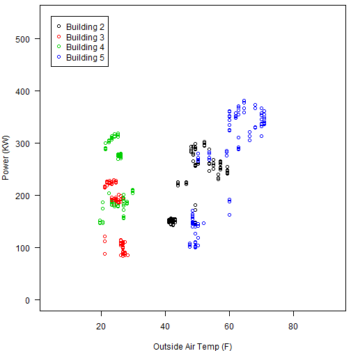

## Power utilization in retail buildings 

This dataset contains recordings of the energy consumption and outdoor air temperature of four retail buildings at various locations in the U.S. at 15 minute intervals during 2010. The measurements have
been anonymized by applying a random linear transformation.
The variables in the data are described below:

Variable | Description
---------|-----------------
building | An integer identifying each of the four buildings
dateTime | The date and time when the power and temperature were recorded
year | Integer indicating the year of the measurement (all
date | The date of the measurement
quarter | The quarter of the year (Q1, Q2, Q3, Q4)
month | The month, represented as an integer (1, 2, ..., 12)
monthName | The name of the month ("January", "Februrary", ..., "December")
week |  Integer indicating the week in 2010 (1, 2, 3, ..., 53)
weekDay | The day of the week ("Monday", "Tuesday", ..., "Sunday")
day | Integer indicating the Julian day in 2010 (number of days since Jan 1, 2010)
OAT.F | Outdoor Air Temperature measured in Farenheit
Power.KW | Instantaneous power consumption by the building at the date time, measured in Kilowatts

# Preliminaries

Let's begin by setting the working directory for this example. You may have to change the path in the command below to correctly point to the `power_demo` directory.


```r
setwd("power_demo")
```

And let's remove any possible left-over objects in the Global environment:

```r
rm(list = ls())
```

And load the requisite packages:

```r
library(trelliscope)
library(plyr)
```

# Pre-made Trelliscope Displays 

The following will launch two pre-made trelliscope displays:
- Power vs. Time 
- Power vs. Outdoor Air Temp 
where each panel shows data for all four buildings for a single day.  

The purpose of this activity is to launch the Trelliscope display and then explore the data---to look for patterns, bad data, anomalies, etc. The code required to generate these displays is shown next.


```r
# Load some preconfigured global plotting limits
load("plottingLims.Rdata")

# Open the connection to the pre-existing trelliscope visualization.
# ("vdb_power" is a folder in "power_demo")
vdbConn("vdb_power")

# use this port when running locally on your own computer
myport <- 8100 

# use this port on the AWS demo cluster
# myport <- Sys.getenv("TR_PORT") 

# Launch the trelliscope viewer.  Use Ctrl-C or ESC to stop the reviewer and return
# the R prompt
view(port = myport)
```

## Challenge Questions
Do your best to answer the following questions. We have placed them here to help you learn how to use trelliscope. Don't worry if you don't know the answer. The results will not show up on your transcript. Be sure to pull up the trelliscope display (if it's not already open) from the code above.

- Without manually scrolling through all the panels, can you identify the days when the power consumption pattern is noticeably different than normal consumption patterns?
- Given the data, can you conclude that there are faulty sensors on or in the buildings?
- Is there a seasonal trend in power consumption?
- Given that each building is in a unique location, can you conclude that outdoor air temperature is correlated with power usage? 

# Making your own Trelliscope Displays 

This activity will teach you how to create your own Trelliscope displays. We will be using the same data as presented in the pre-made displays, but you will have the opportunity to interact with the underlying code. This tutorial will demonstrate how to generate your own plots and how to create and use cognostics to aid in the interpretability of said plots.

We'll start by importing the necessary libraries and reading in the power data. Note that you will have to supply the correct filepath in the call to `read.csv()` below.


```r
# Load the trelliscope package if you haven't already
library(trelliscope)
library(datadr)

# Let's clear the workspace of any residual objects
rm(list = ls())

# You will need to change this. Be sure this is pointed to the directory containing retailBuildings.csv
setwd("C:/Users/venz586/Documents/docs-csp2015/demos/power_demo/")

# We'll begin by reading in the data. Be sure to supply
# the correct filepath or this will fail. 
d <- read.csv("retailBuildings.csv")
```

It's standard practice, when analyzing a new set of data, to get a sense of the underlying structure. The R programming language has many convenient functions for doing this and `str()` is one of the best for getting a sense of the dimensions and entries in the data set.   


```r
# Observe the first 6 rows of the dataset
head(d)
```

```
  building            dateTime year       date quarter month monthName
1        2 2010-01-01 01:15:00 2010 2010-01-01      Q1     1   January
2        2 2010-01-01 01:30:00 2010 2010-01-01      Q1     1   January
3        2 2010-01-01 01:45:00 2010 2010-01-01      Q1     1   January
4        2 2010-01-01 02:00:00 2010 2010-01-01      Q1     1   January
5        2 2010-01-01 02:15:00 2010 2010-01-01      Q1     1   January
6        2 2010-01-01 02:30:00 2010 2010-01-01      Q1     1   January
  week weekday day    OAT.F Power.KW
1    1  Friday   1 43.79894 126.7764
2    1  Friday   1 43.79894 127.3692
3    1  Friday   1 43.79894 124.4899
4    1  Friday   1 43.79894 124.5745
5    1  Friday   1 43.09446 123.3042
6    1  Friday   1 43.09446 122.4574
```

```r
# Now let's look at the structure of the data.
# Notice how there are 139740 rows and 12 columns, and that
# dateTime and date are stored as factors
str(d)
```

```
'data.frame':	139740 obs. of  12 variables:
 $ building : int  2 2 2 2 2 2 2 2 2 2 ...
 $ dateTime : Factor w/ 34935 levels "2010-01-01 01:15:00",..: 1 2 3 4 5 6 7 8 9 10 ...
 $ year     : int  2010 2010 2010 2010 2010 2010 2010 2010 2010 2010 ...
 $ date     : Factor w/ 364 levels "2010-01-01","2010-01-02",..: 1 1 1 1 1 1 1 1 1 1 ...
 $ quarter  : Factor w/ 4 levels "Q1","Q2","Q3",..: 1 1 1 1 1 1 1 1 1 1 ...
 $ month    : int  1 1 1 1 1 1 1 1 1 1 ...
 $ monthName: Factor w/ 12 levels "April","August",..: 5 5 5 5 5 5 5 5 5 5 ...
 $ week     : int  1 1 1 1 1 1 1 1 1 1 ...
 $ weekday  : Factor w/ 7 levels "Friday","Monday",..: 1 1 1 1 1 1 1 1 1 1 ...
 $ day      : int  1 1 1 1 1 1 1 1 1 1 ...
 $ OAT.F    : num  43.8 43.8 43.8 43.8 43.1 ...
 $ Power.KW : num  127 127 124 125 123 ...
```

It would be useful to get an idea of the number of entries of each variable in our data set as well as a summary of each variable. We can use the `table()` and `summary()` functions to gather this data. 


```r
# Let's convert the dateTime and date to a POSIXct format so R can compute with
# them as dates
d$dateTime <- as.POSIXct(d$dateTime)
d$date <- as.POSIXct(d$date)
str(d)
```


```r
# The summary method applied to a data frame can be helpful to get
# a feel for the values in the data
summary(d)
```

```
    building                   dateTime           year     
 Min.   :2.00   2010-01-01 01:15:00:     4   Min.   :2010  
 1st Qu.:2.75   2010-01-01 01:30:00:     4   1st Qu.:2010  
 Median :3.50   2010-01-01 01:45:00:     4   Median :2010  
 Mean   :3.50   2010-01-01 02:00:00:     4   Mean   :2010  
 3rd Qu.:4.25   2010-01-01 02:15:00:     4   3rd Qu.:2010  
 Max.   :5.00   2010-01-01 02:30:00:     4   Max.   :2010  
                (Other)            :139716                 
         date        quarter        month          monthName    
 2010-01-02:   384   Q1:34524   Min.   : 1.000   August :11904  
 2010-01-03:   384   Q2:34944   1st Qu.: 4.000   July   :11904  
 2010-01-04:   384   Q3:35328   Median : 7.000   May    :11904  
 2010-01-05:   384   Q4:34944   Mean   : 6.512   October:11904  
 2010-01-06:   384              3rd Qu.:10.000   March  :11888  
 2010-01-07:   384              Max.   :12.000   January:11884  
 (Other)   :137436                               (Other):68352  
      week            weekday           day            OAT.F       
 Min.   : 1.00   Friday   :19948   Min.   :  1.0   Min.   : 4.351  
 1st Qu.:14.00   Monday   :19968   1st Qu.: 91.0   1st Qu.:44.543  
 Median :27.00   Saturday :19968   Median :182.0   Median :53.089  
 Mean   :26.55   Sunday   :19952   Mean   :181.9   Mean   :55.245  
 3rd Qu.:40.00   Thursday :19968   3rd Qu.:273.0   3rd Qu.:69.160  
 Max.   :53.00   Tuesday  :19968   Max.   :364.0   Max.   :92.901  
                 Wednesday:19968                                   
    Power.KW    
 Min.   :  0.0  
 1st Qu.:192.0  
 Median :254.8  
 Mean   :257.9  
 3rd Qu.:317.4  
 Max.   :543.3  
                
```

```r
# It would be nice to see a tabulation of the categorial variables.
# We can do that like this:
with(d, table(building))
```

```
building
    2     3     4     5 
34935 34935 34935 34935 
```


```r
# To make tables for all the categorical variables, let's create a
# vector with the names of these variables so we can easily select them:
sel <- c("building", "year", "quarter", "month", "monthName", "week", "weekday")

# Now we use that vector to select those columns of 'd', and we can apply
# the table() function to each column (column-wise summaries are indicated by
# MARGIN = 2)
apply(d[,sel], MARGIN = 2, table)

# We can also make cross tabulations to get a sense of the counts of
# two categorical variables.  For example, let's look at month by building:
with(d, table(month, building))
```

Now that we've observed the data from the outside, the time has come to get our hands dirty. We will accomplish this task by subdividing the data into meaningful groups and making a plot of each group. A time series plot of the energy consumption of each building per day would be useful. To accomplish this, we'll need to divide the data by date and create a *distributed data frame* (ddf) object using the `divide()` function from the datadr package. After that, we will sort each data frame by building and dateTime using the `arrange()` function from the plyr package. 


```r
# import the plyr package
library(plyr)
byDate <- divide(d, by = "date", postTransFn = function(x) arrange(x, building, dateTime))

# Let's look at a single element of the ddf:
str(byDate[1])

# Now let's compute the range of the power so we can use the same axes for all 
# the plots
powerLims <- range(d$Power.KW)
tempLims <- range(d$OAT.F)

# Now we create a function to plot the power usage in all 5 buildings for a 
# single day
power.by.time <- function(x) {

  # Get the x and y axis limits
  # Global limits for y
  ylim <- powerLims
  # Local limits for x
  xlim <- range(x$dateTime)

  # Set plotting options
  par(las = 2, mar = c(4, 4, 0.5, 0.5))

  # Create a blank plot
  with(x, plot(dateTime, Power.KW, type = "n", xlim = xlim, ylim = ylim,
               xlab = "", ylab = "Power (KW)"))

  # Add in the data for each building, giving each building a different color
  for (i in as.character(2:5)) {
    with(x[x$building == i,], 
       lines(dateTime, Power.KW, col = as.numeric(i) - 1, lwd = 2))
  }

  # Add a legend to the plot
  legend(xlim[1] + 0.5 * diff(xlim), ylim[1],
         paste("Building", 2:5),
         lty = 1, col = c(2:5) - 1, lwd = 3, yjust = 0)

  # Returning NULL is required by trelliscope when the plotting function is 
  # base R code (as opposed to plots generated by lattice or ggplot)
  return(NULL)

} # power.by.time()
```


```r
# Test the plot on a single subset
power.by.time(byDate[[8]][[2]])
```

```
## Warning in xy.coords(x, y, xlabel, ylabel, log): NAs introduced by
## coercion
```

```
## Error in plot.window(...): invalid 'xlim' value
```

 

## Using cognostics to improve EDA 

Sometimes it is useful to display order statistics or other information along with the phyiscal plot. These extra bits of information are called "cognostics" and they can help the user get a better sense of the big picture. Some cognostics are built into the trelliscope package, but users are also free to create their own. 


```r
# Next we create cognostics function that defines the cognostics (measures of 
# interest) that will be calculated (and visualizable) for each plot.  Keep in 
# mind that each cognostic should consist of a scalar value.  The input to the 
# cognostics function ('x') is a dataframe that contains one split, or one 
# subset, of the data.  In this case it is a dataframe that contains all the 
# data for a given date.
kwCog <- function(x) { 
  
  list(

  # Compute the max and min for each day
  max = cog(max(x$Power.KW, na.rm = TRUE), desc = "Max Power (KW)"),
  min = cog(min(x$Power.KW, na.rm = TRUE), desc = "Min Power (KW)"),

  # Some common statistics are built into trelliscope with their own cognostics functions.
  # For example, cogMean() and cogRange().
  meanPower = cogMean(x$Power.KW, desc = "Mean Power (KW)"),
  rangePower = cogRange(x$Power.KW, desc = "Range of Power (Max - Min) (KW)"),

  # Note that we use 'unique()' below because, for each subset, the value of 
  # month, week, and day are all repeated for a single date. So we use unique() 
  # to get a scalar value of these date variables
  month = cog(unique(x$monthName), desc = "Month Name"),
  week = cog(unique(x$week), desc = "Week in 2010"),
  day = cog(unique(x$day), desc = "Julian Day in 2010")

  )

} # kwCog()
```

Let's take a look at the information gathered from our cognostics function. You may have noticed that trelliscope has some pre-defined cognostics like `cogMean()` and `cogRange()`. You can define your own cognostics by using the `cog()` function. 


```r
# Test the cognostics function for the 7th subset
kwCog(byDate[[73]][[2]])
```

```
## $max
## [1] 373.5434
## 
## $min
## [1] 164.8856
## 
## $meanPower
## [1] 235.155
## 
## $rangePower
## [1] 208.6579
## 
## $month
## [1] "March"
## 
## $week
## [1] 11
## 
## $day
## [1] 73
```

In trelliscope, you have to define a plotting function for the visual data base. We will create a simple function for plotting power consumption versus temperature and apply it to `byDate`.


```r
# Open connection to the trelliscope visualization database (vdb)
vdbConn("vdb_power", autoYes = TRUE)

# Create first display using Trelliscope's makeDisplay() function.  This writes
# the various plots to the vdb that can then be viewed with trelliscope.
makeDisplay(byDate, name = "Power_by_Day",
            desc = "Power time series for 2010 buildings by day",
            panelFn = power.by.time, cogFn = kwCog)
```

```
## Warning in xy.coords(x, y, xlabel, ylabel, log): NAs introduced by
## coercion
```

```
## Error in plot.window(...): invalid 'xlim' value
```

 

```r
# Let's also create a related display of power versus temperature by date
power.v.temp <- function(x) {

  # Get the limits
  xlim <- tempLims
  ylim <- powerLims

  # Set plotting parameters
  par(las = 1, mar = c(4, 4, 0.5, 0.5))

  # Create a blank plot for outdoor air temp vs. power
  with(x, plot(OAT.F, Power.KW, type = "n", xlim = xlim, ylim = ylim,
               xlab = "Outside Air Temp (F)", ylab = "Power (KW)"))

  # Add points for each building with a different color
  for (i in as.character(2:5)) {
    with(x[x$building == i,], points(OAT.F, Power.KW, col = as.numeric(i)-1))
  }

  # Add in the legend
  legend(xlim[1], ylim[2],
         paste("Building", 2:5),
         pch = 1,
         col = c(2:5) - 1)

  # Returning NULL is required by trelliscope when the plotting function is 
  # base R code (as opposed to plots generated by lattice or ggplot)
  return(NULL)

} # power.v.temp()
```

It's almost always a good idea to test a function on a single element of a distributed data object before attempting to apply it over the entire object. 


```r
# Test the plot on a single subset
power.v.temp(byDate[[8]][[2]])
```

 

```
## NULL
```


```r
# Make the trelliscope display
makeDisplay(byDate, name = "Power_vs_Temp_by_Day",
            desc = "Power vs. Temperature for 2010 buildings by day",
            panelFn = power.v.temp, cogFn = kwCog)

# Launch the trelliscope viewer (must be in Firefox, Chrome, or Safari--not 
# Internet Explorer)
myport <- 8100 # use this when running locally
# myport <- Sys.getenv("TR_PORT") # use this on demo cluster
view(port = myport)
```
